# Restore Workflow Diagrams

Visual diagrams for understanding the restore system architecture and flow.

## Table of Contents

- [Complete Restore Workflow](#complete-restore-workflow)
- [Category Decision Tree](#category-decision-tree)
- [Service Management Flow](#service-management-flow)
- [Two-Pass Extraction](#two-pass-extraction)
- [Cluster Database Restore Sequence](#cluster-database-restore-sequence)
- [Error Handling Flow](#error-handling-flow)

---

## Complete Restore Workflow

```mermaid
flowchart TD
    Start([User runs --restore]) --> SelectBackup[Select Backup Source]
    SelectBackup --> ScanBackups[Scan for Backups]
    ScanBackups --> ChooseBackup[Choose Specific Backup]

    ChooseBackup --> CheckEncryption{Encrypted?}
    CheckEncryption -->|Yes| Decrypt[Decrypt with AGE]
    CheckEncryption -->|No| SystemDetect[Detect System Type]
    Decrypt --> VerifyChecksum[Verify SHA256]
    VerifyChecksum --> SystemDetect

    SystemDetect --> Compatibility[Validate Compatibility]
    Compatibility --> CompatCheck{Compatible?}
    CompatCheck -->|No| WarnUser[Warn User]
    WarnUser --> UserDecision{Continue?}
    UserDecision -->|No| Abort([Abort])
    UserDecision -->|Yes| AnalyzeCategories
    CompatCheck -->|Yes| AnalyzeCategories[Analyze Categories]

    AnalyzeCategories --> SelectMode[Select Restore Mode]
    SelectMode --> ModeChoice{Mode?}
    ModeChoice -->|Full| GetFullCats[All Categories]
    ModeChoice -->|Storage| GetStorageCats[Storage Categories]
    ModeChoice -->|Base| GetBaseCats[Base Categories]
    ModeChoice -->|Custom| CustomSelect[Interactive Selection]

    GetFullCats --> ShowPlan[Show Restore Plan]
    GetStorageCats --> ShowPlan
    GetBaseCats --> ShowPlan
    CustomSelect --> ShowPlan

    ShowPlan --> Confirm{Type RESTORE?}
    Confirm -->|No| Abort
    Confirm -->|Yes| SafetyBackup[Create Safety Backup]

    SafetyBackup --> SafetyOK{Success?}
    SafetyOK -->|No| AskContinue{Continue anyway?}
    AskContinue -->|No| Abort
    AskContinue -->|Yes| CheckCluster
    SafetyOK -->|Yes| CheckCluster{Cluster Restore?}

    CheckCluster -->|Yes| StopServices[Stop PVE Services]
    StopServices --> UnmountPVE[Unmount /etc/pve]
    UnmountPVE --> DeferRestart[Defer Service Restart]
    DeferRestart --> ExtractNormal

    CheckCluster -->|No| ExtractNormal[Extract Normal Categories]
    ExtractNormal --> ExtractExport{Export Categories?}
    ExtractExport -->|Yes| ExtractToExport[Extract to Export Dir]
    ExtractExport -->|No| PostRestore
    ExtractToExport --> PostRestore[Post-Restore Tasks]

    PostRestore --> RecreateDir[Recreate Directories]
    RecreateDir --> CheckZFS{ZFS Category?}
    CheckZFS -->|Yes| WarnZFS[Warn About ZFS Import]
    CheckZFS -->|No| RestartServices
    WarnZFS --> RestartServices[Restart Services - Deferred]

    RestartServices --> DisplaySummary[Display Summary]
    DisplaySummary --> Success([Success])

    style Start fill:#90EE90
    style Success fill:#90EE90
    style Abort fill:#FFB6C1
    style StopServices fill:#FFD700
    style RestartServices fill:#FFD700
```

---

## Category Decision Tree

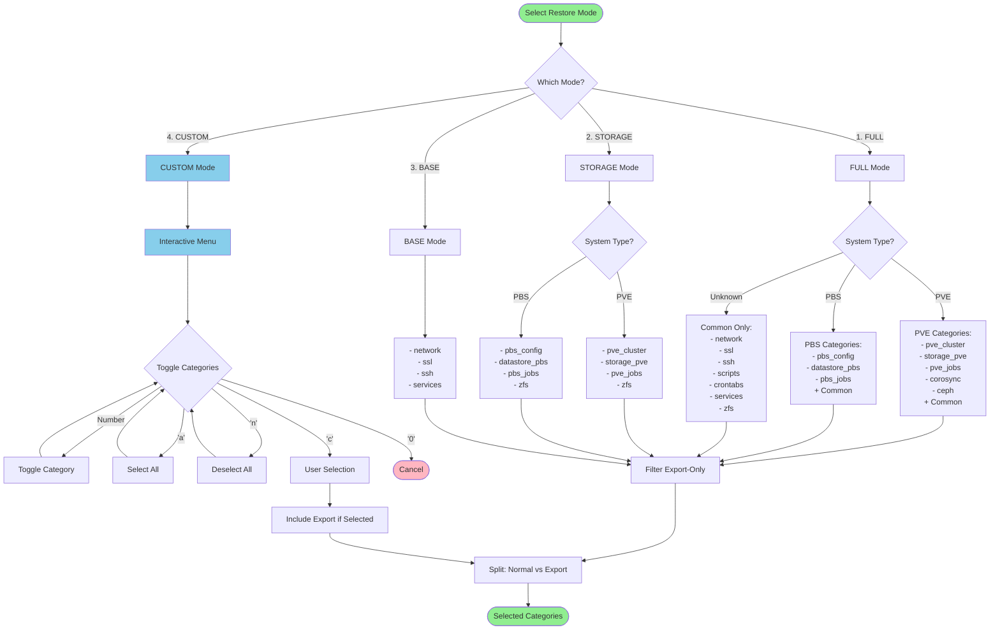

---

## Service Management Flow

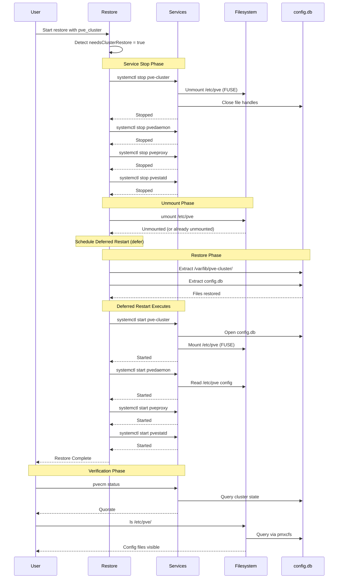

---

## Two-Pass Extraction

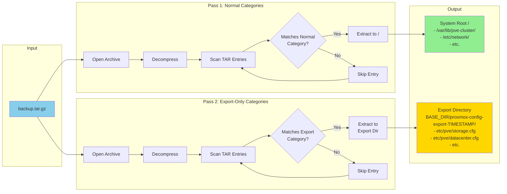

---

## Cluster Database Restore Sequence

```mermaid
stateDiagram-v2
    [*] --> Running: Initial State

    state Running {
        [*] --> ServicesActive
        ServicesActive: pve-cluster: active
        ServicesActive: pvedaemon: active
        ServicesActive: pveproxy: active
        ServicesActive: /etc/pve: mounted
    }

    Running --> Stopping: User initiates restore

    state Stopping {
        [*] --> StopCluster
        StopCluster: systemctl stop pve-cluster
        StopCluster --> StopDaemon
        StopDaemon: systemctl stop pvedaemon
        StopDaemon --> StopProxy
        StopProxy: systemctl stop pveproxy
        StopProxy --> StopStatd
        StopStatd: systemctl stop pvestatd
        StopStatd --> UnmountPVE
        UnmountPVE: umount /etc/pve
        UnmountPVE --> [*]
    }

    Stopping --> Stopped: All services stopped

    state Stopped {
        [*] --> ServicesStopped
        ServicesStopped: All services: inactive
        ServicesStopped: /etc/pve: unmounted
        ServicesStopped: config.db: not in use
    }

    Stopped --> Restoring: Extract files

    state Restoring {
        [*] --> ExtractDB
        ExtractDB: Extract /var/lib/pve-cluster/
        ExtractDB --> WriteFiles
        WriteFiles: Write config.db
        WriteFiles: Write supporting files
        WriteFiles --> [*]
    }

    Restoring --> Restarting: Files restored

    state Restarting {
        [*] --> StartCluster
        StartCluster: systemctl start pve-cluster
        StartCluster --> ReadDB
        ReadDB: pmxcfs reads config.db
        ReadDB --> MountPVE
        MountPVE: Mount /etc/pve (FUSE)
        MountPVE --> StartDaemon
        StartDaemon: systemctl start pvedaemon
        StartDaemon --> StartProxy
        StartProxy: systemctl start pveproxy
        StartProxy --> StartStatd
        StartStatd: systemctl start pvestatd
        StartStatd --> [*]
    }

    Restarting --> Restored: Services restarted

    state Restored {
        [*] --> ServicesRestored
        ServicesRestored: All services: active
        ServicesRestored: /etc/pve: mounted with RESTORED config
        ServicesRestored: Cluster: operational
    }

    Restored --> [*]: Restore complete
```

---

## Error Handling Flow

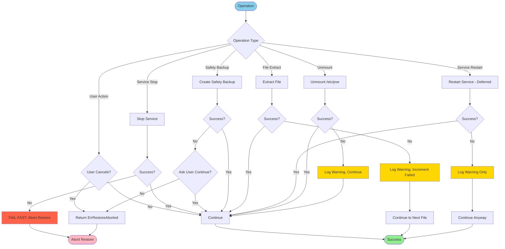

---

## Path Matching Algorithm

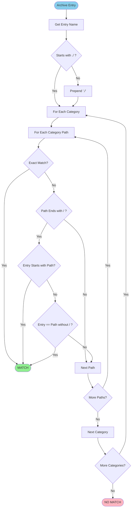

**Examples**:

| Archive Entry | Category Path | Result |
|--------------|---------------|--------|
| `./etc/network/interfaces` | `./etc/network/` | ✅ Prefix match |
| `./etc/hostname` | `./etc/network/` | ❌ No match |
| `etc/hostname` | `./etc/hostname` | ✅ After normalize |
| `./var/lib/pve-cluster/config.db` | `./var/lib/pve-cluster/` | ✅ Prefix match |

---

## Category Type Filter

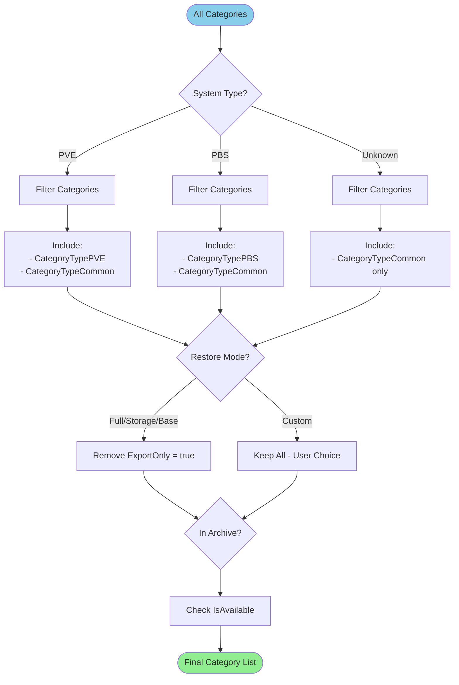

---

## Safety Backup Process

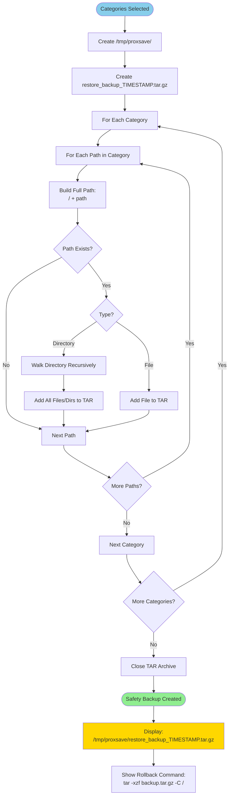

---

## Decryption Workflow

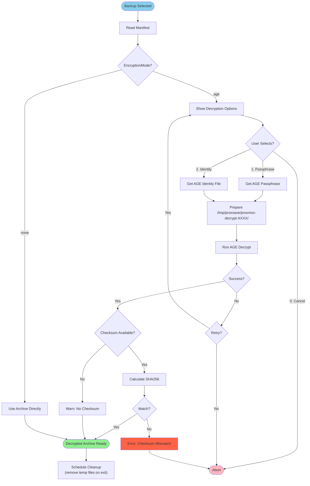

---

## Storage Directory Recreation

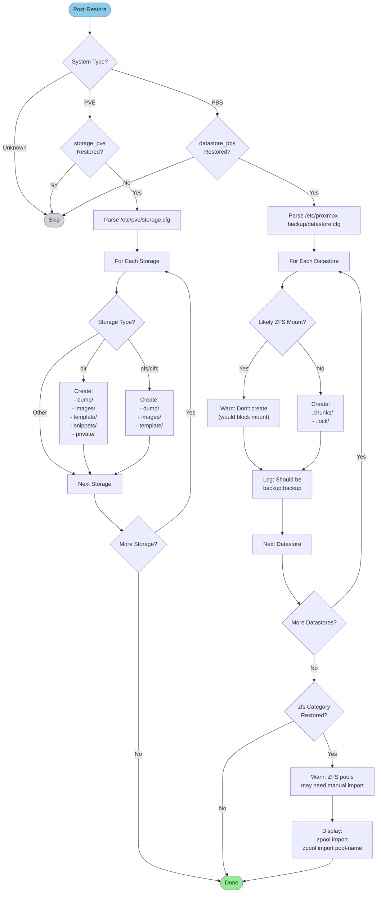

---

## Compatibility Validation

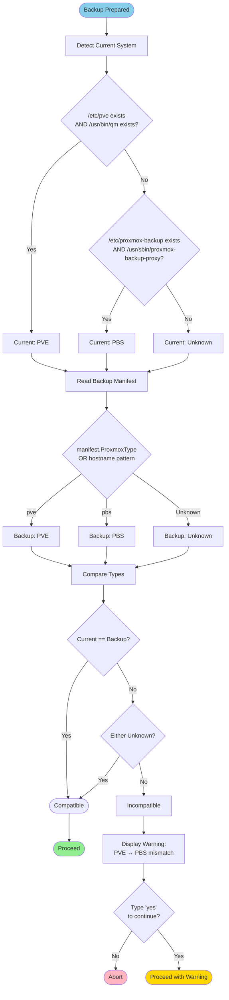

---

## Usage Examples

### Viewing Diagrams

**GitHub**: Mermaid diagrams render automatically in GitHub markdown.

**VS Code**: Install "Markdown Preview Mermaid Support" extension.

**Command Line**: Use `mermaid-cli` to generate images:
```bash
npm install -g @mermaid-js/mermaid-cli

# Generate PNG
mmdc -i docs/RESTORE_DIAGRAMS.md -o diagrams/

# Generate SVG
mmdc -i docs/RESTORE_DIAGRAMS.md -o diagrams/ -t svg
```

**Web Browser**: Copy diagram to https://mermaid.live/

---

## Related Documentation

- [RESTORE_GUIDE.md](RESTORE_GUIDE.md) - Complete user guide
- [RESTORE_TECHNICAL.md](RESTORE_TECHNICAL.md) - Technical architecture
- [CLUSTER_RECOVERY.md](CLUSTER_RECOVERY.md) - Disaster recovery procedures
